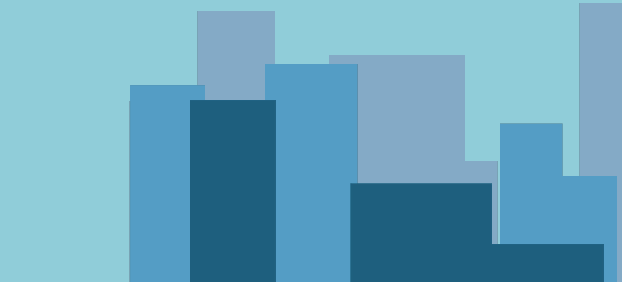
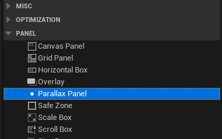
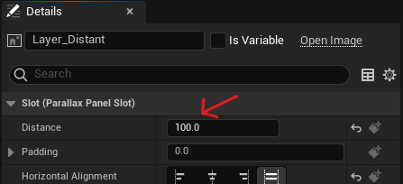
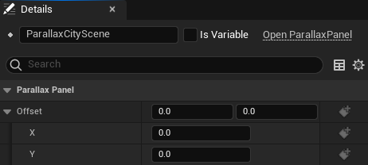

# Parallax Panel
A 2D panel widget that simulates a 3D depth effect in user interfaces.



## Features
* Simple and lightweight panel
* Any widget can be a layer
* Supports [widget animations](https://docs.unrealengine.com/5.3/en-US/animating-umg-widgets-in-unreal-engine/)

## User Guide
1. In a widget blueprint, create a Parallax Panel widget from the palette.

<br/>
2. Add child widgets to the panel. Set the **Distance** of the layer under *Slot (Parallax Panel Slot)* in the Details panel.

<br/>
3. The **Offset** property in the Parallax Panel controls the perspective.


## Layer Distance & Offset
The parallax scrolling equation used in this plugin is:

```math
Transform = Offset\cdot\frac{1}{1+(\frac{Distance}{100})}
```

A layer with a distance of 100 will move twice as slow as a layer with a distance of zero.

---------------------

Forest icons created by Freepik - [Flaticon](https://www.flaticon.com/free-icons/forest)
